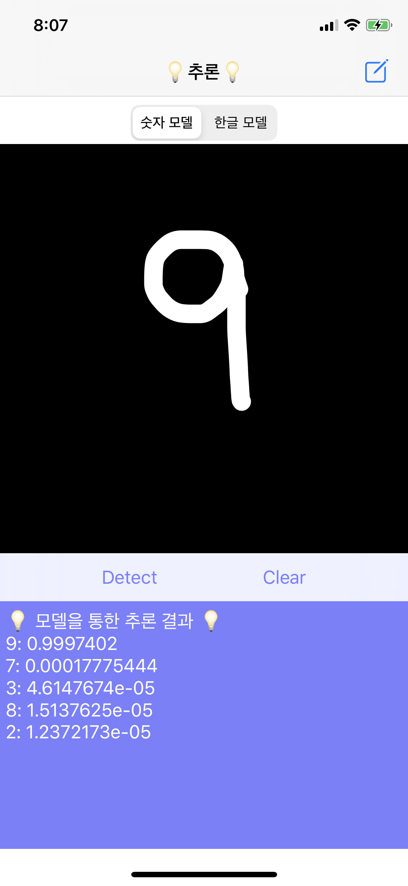
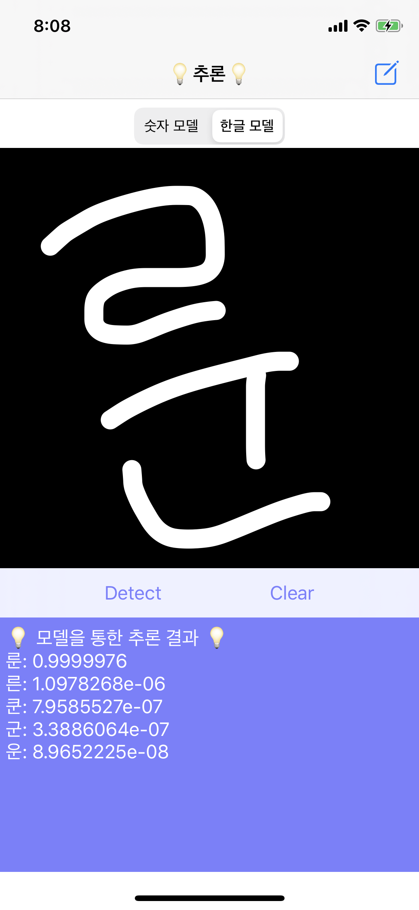

<h1 align="center">Welcome to HangulTensorflow 👋</h1>

> CNN 으로 한글 학습한 Model을 실행하는 iOS 앱

## What is it?

Python 의 tensorflow로 한글 데이터를 CNN 방식으로 학습하여 생성된 모델을 tflite 으로 변환하여 로컬에 저장

로컬의 모델을 읽어 결과값을 유저에게 보여준다.

## 실행결과

## Reference

[firebase-quickstart-ios](https://github.com/firebase/quickstart-ios)

[drawView](https://github.com/Awalz/SwiftyDraw)

## Author

👤 **이하은**

* Github: [@Haeuncs](https://github.com/Haeuncs)

## Show your support

Give a ⭐️ if this project helped you!

***
_This README was generated with ❤️ by [readme-md-generator](https://github.com/kefranabg/readme-md-generator)_